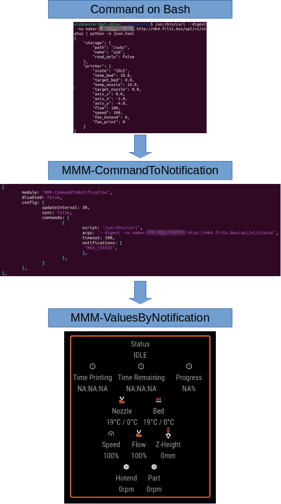

# MMM-CommandToNotification

MagicMirror² module which periodically calls configured scripts and sends the output as value of configurable notifications. The values can be displayed in modules like [MMM-ValuesByNotification](https://github.com/Tom-Hirschberger/MMM-ValuesByNotification).

Example scripts to read the temperature values of DHT11, DHT22, DS18B20, HTU21 or BME280 connected to the raspbarry or Miflora sensors in reach of bluetooth are included in the scripts directory. There is a documentation in the [scripts directory](./scripts/README.md), too.

## Basic installation

```bash
cd ~/MagicMirror/modules
git clone https://github.com/Tom-Hirschberger/MMM-CommandToNotification
cd MMM-CommandToNotification
npm install
```

## Basic configuration

Add the following code to your ~/MagicMirror/config/config.js:

```json5
  {
   module: "MMM-CommandToNotification",
   disabled: false,
   config: {
    commands: [
    ]
   },
  },
```

### General

| Option  | Description | Type | Default |
| ------- | --- | --- | --- |
| updateInterval | How often should the scripts be iterated (in seconds) | Integer | 30 |
| commands | A array containing the command definition objects | Array | [] |
| sync | Should the commands called one by one (true) or should all be started as fast as possible (false). Can be overriden for each command in the command configuration | Boolean | true |
| debug | This flag controls if debug messages should be output on the console | Boolean | false |

### Commands

| Option  | Description | Mandatory | Type | Default |
| ------- | --- | --- | --- | --- |
| script | Either a absolute path or the realtive path of a script starting at the "scripts" directory. Make sure to add a "./" as prefix if you call a script in the "scripts" directory. | true | String | null |
| args | Arguments which should be passed to the script | false | String | "" |
| timeout | Should the script be killed if it does not return within a specific amount of milliseconds? | false | Integer | infinity |
| notifications | A array containing names of the notifications to send if script returns output. If not present the script gets called but no notification will be send. If you want to override the payload instead of using the output please look at the notification section. | false | Array | [] |
| sync | Should the command by run synchronous (next command will be called after this one, true) or asynchronous (directly proceed with the next one and process output when the command finishes, false) | Boolean | true |
| delayNext | Wait some amount of time (milliseconds) before the next command will be processed after this one has called. Make sure to set to updateInterval of the module to a value that is enough time to call and process all commands with all delays summed up! | Integer | 0 |
| conditions | A map containing conditions that need to match to send the notifications | false | Map | null |

### Notifications

The notifications array contains all notifications that should be send if a command is called (and the conditions matched).
There may be situations where you want send a notification with a specific payload instead of the output of the script. You can do so if you specify a array instead of the string identifiying the notification.
Lets see the following example:

```json
notifications: [
  ["TEST1","MY_NEW_PAYLOAD"],
  "TEST2",
],
```

In this example the notification "TEST1" will have "MY_NEW_PAYLOAD" as output while "TEST2" contains the output of the command.

### Conditions

**All conditions specified need to match to send notifications!**

| Option  | Description | Type | Default |
| ------- | --- | --- | --- |
| returnCode | Specify either a single return code or a array of return codes that need to match. If a array is specified one of the values need to match (or condition). | Integer or Array of Integer | null |
| outputContains | Specify either a single string or a array of possible strings which of one need to be present in the output (or condition). | null |

### Example

Add the following example to produce the following result:

* the scripts will be iterated every 10 seconds
* the script "scripts/randomInteger.js" gets called every iteration
  * a random number between -10 and 10 is produced
  * the timeout of the script is 5 seconds. If the script does not produce any output within 5 seconds the call will be aborted and no notifications will be send
  * if the script produces output the output will be send as payload of the notifications TEST1 and TEST2
* the script "scripts/randomNumberJson.js" will be called every fourth iteration because a three skips are configured
  * the script calculates a random number between -50 and 20 and produces a json object containing two values ("integer" and "float"). The float value is the random number the integer value the random number rounded as integer.
  * the timeout of the script is set to 10 seconds
  * the result of the script (JSON object as string) will be send as payload of notification TEST3 while TEST4 will be send with payload "true"
  * As the condition `returnCode` is set to `[0,1,2]` the notifications `TEST3` and `TEST4` only will be send if the script `./randomNumberJson.js` only will be send if the script exits with code 0, 1 or 2

```json5
  {
   module: "MMM-CommandToNotification",
   disabled: false,
   config: {
    updateInterval: 10,
    commands: [
     {
      script: "./randomInteger.js",
      args: "-10 10",
      timeout: 5,
      notifications: [
       "TEST1",
       "TEST2",
      ],
     },
     {
      script: "./randomNumberJson.js",
      args: "-50 20",
      skips: 3,
      timeout: 10,
      conditions: {
        returnCode: [0,1,2]
      }
      notifications: [
       "TEST3",
       ["TEST4", true]
      ],
     }
    ]
   },
  },
```

#### My Prusa MK4 3D-Printer setup

MMM-CommandToNotification->MMM-ValuesByNotification" width="600px"/>